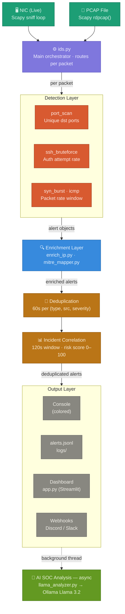

# 🛡️ NetIDS — Lightweight Network Intrusion Detection System

> A Python-based IDS that detects reconnaissance and attack behavior in real time using rolling time windows and threshold-based logic.


---

## 📋 Table of Contents

- [Overview](#overview)
- [Architecture](#architecture)
- [Features](#features)
- [How It Works](#how-it-works)
- [Installation](#installation)
- [Usage](#usage)
- [Alert Format](#alert-format)
- [Detection Thresholds](#detection-thresholds)
- [Project Structure](#project-structure)

---

## Overview

NetIDS is a lightweight, command-line Network Intrusion Detection System built with Python and Scapy. It supports two operation modes:

- **Live Mode** — Sniffs packets directly from a network interface in real time via Scapy's sniff loop
- **PCAP Mode** — Analyzes pre-captured `.pcap` files for offline forensic investigation via `rdpcap()`

Detection is based on rolling time-window counters and configurable thresholds. All alerts are emitted in **JSON Lines** format for easy parsing and integration with downstream tools. An optional async AI SOC layer uses a local Llama 3.2 model to provide natural-language triage of correlated incidents.

---

## Architecture



### Layer breakdown

| Layer | Files | Responsibility |
|---|---|---|
| **Input** | `ids.py` | Starts Scapy sniff loop or reads PCAP; feeds raw packets to detectors |
| **Detection** | `port_scan.py`, `ssh_bruteforce.py`, `syn_burst.py`, `icmp_flood.py` | Per-packet evaluation against rolling time-window thresholds |
| **Enrichment** | `enrich_ip.py`, `mitre_mapper.py` | Adds geo/ASN data and maps alerts to MITRE ATT&CK techniques |
| **Deduplication** | `dedup.py` | Suppresses repeated alerts for the same (type, src, severity) within 60s |
| **Incident Correlation** | `incident_manager.py` | Groups alerts by `src_ip` in a 120s window; computes a 0–100 risk score |
| **Output** | `logger.py`, `app.py`, webhooks | Colored console, JSON Lines log, Streamlit dashboard, Discord/Slack |
| **AI SOC** | `llama_analyzer.py` | Async background thread — sends incidents to Ollama (Llama 3.2) for triage |

---

## Features

| Feature | Description |
|---|---|
| 🔍 **TCP Port Scan Detection** | Tracks unique destination ports per source IP in a rolling window |
| 🔐 **SSH Brute Force Detection** | Flags abnormal authentication attempt rates against SSH port |
| 💥 **SYN Burst / SYN Flood Detection** | Detects DoS-indicative SYN packet bursts from a single source |
| 📡 **ICMP Ping Sweep Detection** | Identifies host-discovery sweeps via ICMP echo request rate |
| 🎯 **Live Packet Capture** | Real-time sniffing on any interface via Scapy |
| 📁 **PCAP File Analysis** | Offline forensic analysis of captured traffic |
| 🔗 **MITRE ATT&CK Mapping** | Enriches alerts with relevant technique IDs |
| 🤖 **AI SOC Analysis** | Local Llama 3.2 triage of correlated incidents (async, no cloud) |
| 📝 **JSON Lines Alert Logging** | Structured, timestamped alerts ready for any SIEM pipeline |

---

## How It Works

### Rolling time window

NetIDS tracks per-source-IP events inside a configurable sliding window. When a packet arrives:

1. Retrieve the source IP's event history
2. Prune events older than the window duration
3. Append the new event
4. If the count exceeds the threshold → emit an alert

```
Time ──────────────────────────────────────────────────▶
      [ pruned ] | ←──── window (e.g. 10s) ────→ | now
                         ^^^^^^^^^^^^^^^^^^^^
                         Count events here
                         If count > threshold → ALERT
```

### Incident correlation & risk scoring

After deduplication, `incident_manager.py` groups alerts from the same `src_ip` within a 120-second window into an **incident**. Each incident receives a risk score (0–100) based on the number and severity of constituent alerts. High-risk incidents are forwarded asynchronously to the AI SOC layer.

---

## Installation

```bash
# Clone the repository
git clone https://github.com/LuisVazquez6/NETIDS.git
cd NETIDS

# Core dependency
pip install scapy

# Optional: Streamlit dashboard
pip install streamlit

# Optional: AI SOC (requires Ollama with Llama 3.2 installed locally)
pip install ollama
```

> ⚠️ **Note:** Live packet capture requires root/administrator privileges (`sudo`).

---

## Usage

### Live capture mode

```bash
sudo python ids.py --mode live --interface eth0
sudo python ids.py --mode live --interface eth0 --output alerts.jsonl
```

### PCAP analysis mode

```bash
python ids.py --mode pcap --file capture.pcap
python ids.py --mode pcap --file capture.pcap --output results.jsonl
```

### Streamlit dashboard

```bash
streamlit run dashboard/app.py
```

---

## Alert Format

Alerts are written in **JSON Lines** format — one JSON object per line:

```json
{"timestamp": "2026-03-18T14:23:01Z", "type": "TCP_PORT_SCAN",  "src_ip": "192.168.1.105", "port_count": 142,   "mitre": "T1046", "risk": 72, "window_sec": 10}
{"timestamp": "2026-03-18T14:23:44Z", "type": "SYN_FLOOD",      "src_ip": "10.0.0.22",     "syn_count": 320,    "mitre": "T1499", "risk": 88, "window_sec": 5}
{"timestamp": "2026-03-18T14:24:10Z", "type": "ICMP_SWEEP",     "src_ip": "172.16.0.8",    "host_count": 48,    "mitre": "T1018", "risk": 55, "window_sec": 10}
{"timestamp": "2026-03-18T14:25:02Z", "type": "SSH_BRUTEFORCE", "src_ip": "203.0.113.44",  "attempt_count": 87, "mitre": "T1110", "risk": 91, "window_sec": 30}
```

| Field | Description |
|---|---|
| `timestamp` | ISO 8601 UTC time of alert |
| `type` | Detection type (`TCP_PORT_SCAN`, `SYN_FLOOD`, `ICMP_SWEEP`, `SSH_BRUTEFORCE`) |
| `src_ip` | Source IP that triggered the alert |
| `mitre` | MITRE ATT&CK technique ID |
| `risk` | Incident risk score (0–100) |
| `window_sec` | Rolling window size used for detection |

---

## Detection Thresholds

Default thresholds (configurable in `config.py`):

| Detector | Window | Threshold | Trigger condition |
|---|---|---|---|
| TCP Port Scan | 10s | 50 ports | > 50 unique dst ports from one src |
| SYN Flood | 5s | 200 packets | > 200 SYN-only packets from one src |
| ICMP Sweep | 10s | 20 hosts | > 20 unique dst IPs via ICMP from one src |
| SSH Brute Force | 30s | 10 attempts | > 10 auth attempts to port 22 from one src |

---

## Project Structure

```
NETIDS/
├── ids.py                  # Entry point — arg parsing, starts capture mode
├── config.py               # Thresholds, window sizes, webhook URLs
├── detectors/
│   ├── port_scan.py        # TCP port scan detector
│   ├── ssh_bruteforce.py   # SSH brute force detector
│   ├── syn_burst.py        # SYN burst / SYN flood detector
│   └── icmp_flood.py       # ICMP ping sweep detector
├── enrichment/
│   ├── enrich_ip.py        # IP geolocation + ASN lookup
│   └── mitre_mapper.py     # Maps alert types to MITRE ATT&CK IDs
├── correlation/
│   ├── dedup.py            # 60s alert deduplication / cooldown
│   └── incident_manager.py # 120s incident grouping + risk scoring
├── output/
│   ├── logger.py           # JSON Lines alert writer
│   └── webhooks.py         # Discord / Slack notification sender
├── dashboard/
│   └── app.py              # Streamlit live dashboard
├── ai/
│   └── llama_analyzer.py   # Async Ollama / Llama 3.2 SOC triage
├── logs/
│   └── alerts.jsonl        # Output alert log (auto-generated)
└── README.md
```

---

## Dependencies

- [Python 3.8+](https://www.python.org/)
- [Scapy 2.5+](https://scapy.net/) — Packet capture and parsing
- [Streamlit](https://streamlit.io/) — Dashboard *(optional)*
- [Ollama](https://ollama.com/) + Llama 3.2 — AI SOC triage *(optional)*

---

*NetIDS — Built as a capstone project · [GitHub](https://github.com/LuisVazquez6/NETIDS)*